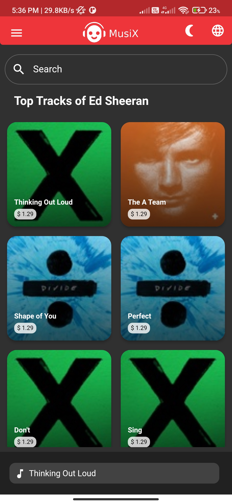
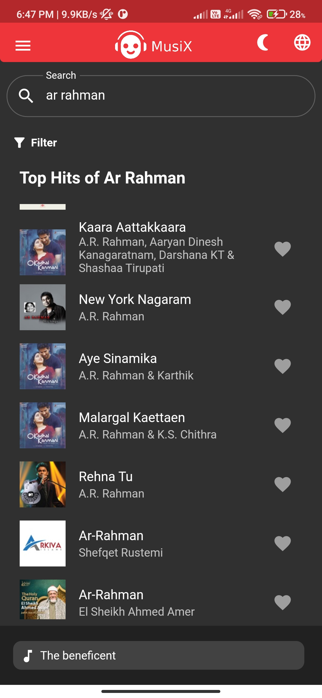
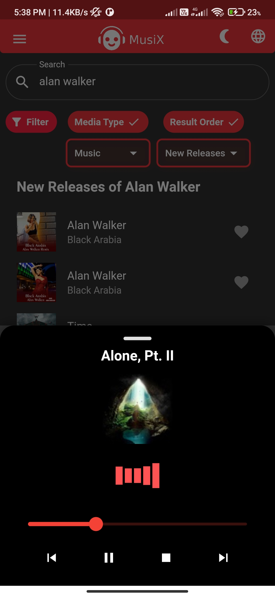
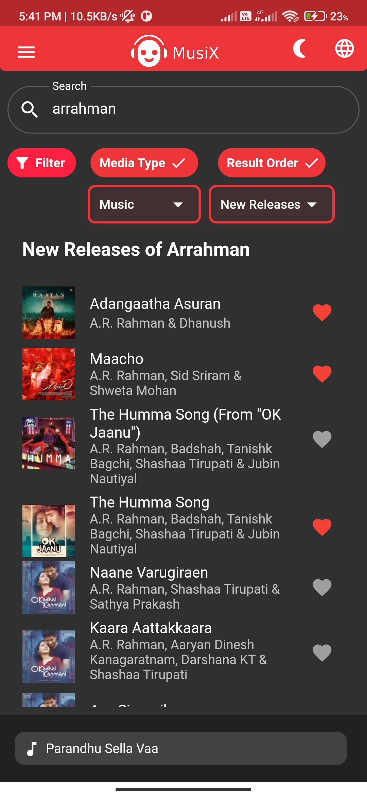
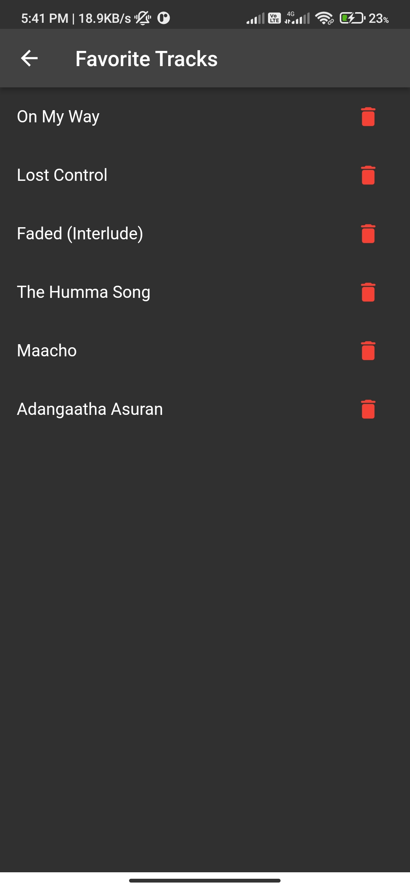
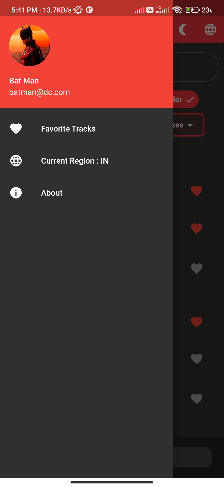

# Musix - Flutter Music Player App

Musix is a Flutter-based music app integrated with iTunes, providing music previews. The app features random top artist hits, a search field for songs, and filter options for media type and result order.

## Features
- 🎵 **Random Top Artists' Hits:** Displays random top artists' hits at launch.
- 🔍 **Search:** Find songs easily with the search field.
- 🎛️ **Filters:** Filter options for media type and result order.
- 🌍 **Region-Based Search:** Search results are customized based on the country you select, ensuring relevant content for your region.
- ❤️ **Favorite Tracks:** Mark tracks as favorites with a heart icon in the list. Favorited tracks are accessible from the Favorite Tracks screen.
- 🎶 **MusicPlayerPage:** Tap on a track to open a bottom sheet with playback controls.
- 💾 **Persistence:** Uses shared preferences to persist favorite tracks even after app restarts.
- 🔄 **Background Playback:** Supports background playback and saves/restores music playback state when navigating back to the app.


## Download APK
You can download the latest APK from the link below:

[**Download Musix.apk**](https://drive.google.com/file/d/11ShWA-BIVUO9dauQROdNjJ1ftCr0O8_f/view?usp=sharing)


## Getting Started

### Prerequisites

- [Flutter](https://flutter.dev/docs/get-started/install) (version 3.19.6)
- A suitable IDE (like Android Studio or Visual Studio Code)

### Installation

1. Clone the repository:

   ```bash
   git clone https://github.com/Jayapriyan-m/musix-flutter-app.git
   cd musix-flutter-app
   
2. Install dependencies

   ```bash
   flutter pub get

3. Run the App

   ```bash
   flutter run

## Screenshots

<table>
  <tr>
    <td align="center">
      
      <p>Home Screen</p>
    </td>
    <td align="center">
      
      <p>Search Result Screen</p>
    </td>
   <td align="center">
      
      <p>Music Playback</p>
    </td>
  </tr>
  <tr>
    <td align="center">
      
      <p>Filter Applying</p>
    </td>
     <td align="center">
      
      <p>Favorites List</p>
    </td>
     <td align="center">
      
      <p>Menu Drawer</p>
    </td>   
  </tr>
</table>


## Contact
For any inquiries or feedback, feel free to reach out:

- **Name:** Jayapriyan M
- **Email:** [jayapriyan11802@gmail.com](mailto:jayapriyan11802@gmail.com)

Happy Coding! 🎧

  
